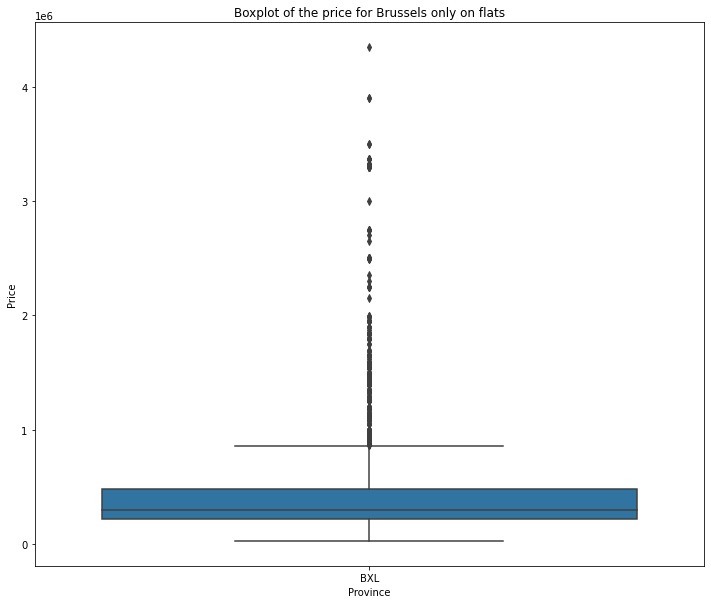

# Challenge data analysis
- Duration: `3 days`
- Deadline: `7/12/2020 13:30`
- Team challenge : 3

## Team members
- [Jérôme Coumont](https://githib.com/jcoumont)
- [Ousmane Diop](https://githib.com/Nooreyni)
- [Guillaume Gémis](https://githib.com/guigem)

## Summary
Our goal is to clean and do a complete analysis and interpretation of the dataset.

#### The Mission
The real estate company "ImmoEliza" wants to establish itself as the biggest one in all of Belglium. To pursue this goal, it needs to create a machine learning model to predict prices on Belgium's sales. That way, they can pick out the properties that are the most valuable to them.

But for this, it needs to do a preliminary analysis to gather some information. Having no in-house data scientist, they are looking for talented people to do it for them.

Since your last encounter with them went great, they reached out to you to do this job. Everything is in your hands now!

Take the dataset previously scraped to do the analysis. *(If you were in different groups, decide together which dataset you are going to use.)*

#### Objectives
- Be able to use `pandas`.
- Be able to use Data visualisation libraries.(`matplotlib` or `seaborn`)
- Be able to clean a dataset for analysis
- Be able to establish conclusions about a dataset.
- Be able to find and answer creative questions about data
- Be able to think outside the box

## The dataset
The initial dataset scraped during the previous challenge contains 10.006 entries.

After a first cleaning we identified a serious problem : *Some province have less than 10 entries*
So we decided to increase the initial dataset with a new version of the scraping tool.
Rather than use the "whole belgian result pages" we splitted the scaping by "whole province result pages".

This small change allows us to bypass the result page limitation sets by default to 333 pages of 30 results (+/- 10 .000 different entries). After a new scraping run the dataset contains not less than **53.730 real estates entries**.

The initial shape is (53.730, 18)
After the data cleaning, the final shape is (37.813, 28)

#### Initial structure

  
View detail

[View file](data/immoweb_scrapped_2.csv) 

| #  | Column              | Type |   value   |
| :- | :------------------ | :--: | :---------|
| 0  | locality            | int  |   zip code |
| 1  | type_of_property    | str  |   type of property (house/appartment) |
| 2  | subtype_of_property | str  |   subtype of property (villa/studio/mansion/loft/...) |
| 3  | price               | int  |   price |
| 4  | type_of_sale        | str  |   type of sale |
| 5  | nr_of_rooms         | int  |   number of room |
| 6  | area                | int  |   area in m2 |
| 7  | equiped_kitchen     | str  |   type of kitchen |
| 8  | furnished           | bool |   is furnished? |
| 9  | open_fire           | bool |   has an open fire?   |
| 10 | terrace             | bool |   has a terrace? |
| 11 | terrace_area        | int  |   terrace area in m2 if existing |
| 12 | garden              | bool |   has garden? |
| 13 | garden_area         | int  |   garden area in m2 if existing |
| 14 | total_land_area     | int  |   total land area in m2 |
| 15 | nr_of_facades       | int  |   number of facades |
| 16 | swimming_pool       | bool |   has a swimming pool? |
| 17 | building_condition  | str  |   state of the building (new/good/to be renovated/ ...) |

#### Cleaned structure

  
View detail

[View file](data/immoweb_cleaned_2.csv)

| #  | Column              | Type |   value   |
| :- | :------------------ | :--: | :---------|
| 0  | locality            | int  |   zip code |
| 1  | type_of_property    | str  |   type of property (house/appartment) |
| 2  | subtype_of_property | str  |   subtype of property (villa/studio/mansion/loft/...) |
| 3  | price               | int  |   price |
| 4  | nr_of_rooms         | int  |   number of room |
| 5  | area                | int  |   area in m2 |
| 6  | equiped_kitchen     | str  |   type of kitchen |
| 7  | open_fire           | bool |   has an open fire?   |
| 8  | terrace             | bool |   has a terrace? |
| 9  | terrace_area        | int  |   terrace area in m2 if existing |
| 10 | garden              | bool |   has garden? |
| 11 | garden_area         | int  |   garden area in m2 if existing |
| 12 | total_land_area     | int  |   total land area in m2 |
| 13 | nr_of_facades       | int  |   number of facades |
| 14 | swimming_pool       | bool |   has a swimming pool? |
| 15 | building_condition  | str  |   state of the building (new/good/to be renovated/ ...) | 
| 16 | kitchen             | bool |   has kitchen ?
| 17 | region              | str  |   region name (Wal./Bxl/Vland.)
| 18 | province            | str  |   province name
| 19 | sq_m_price          | float |  price / m2 (based on area)
| 20 | sq_m_land_price     | float |  price / m2 (based on total_land_area)
| 21 | city                | str |  city name
| 22 | type_of_property_num | int |  type of property in int value
| 23 | subtype_of_property_num | int | subtype of property in int value
| 24 | equiped_kitchen_num     | int | type of equiped kitchen in int value
| 25 | building_condition_num  | int | building condition in int value
| 26 | region_num              | int | region in int value
| 27 | province_num            | int | province in int value

## Data cleaning
This phase is very important to process the analysis phase.
So we identified our goals and the data's needed to reach them.

We need to be able to give the price by cities/provinces/regions.
This price can be expressed in term of global price or price/m2.
And we have also to identify which parameters can influence it.
 

##### Data quality

 

| #  | Column              | Non-null |   %   |
| -: | :------------------ | -------: | ----: |
| 0  | locality            | 53730    |  100% |
| 1  | type_of_property    | 53730    |  100% |
| 2  | subtype_of_property | 53730    |  100% |
| 3  | price               | 50400    |   94% |
| 4  | type_of_sale        | 53730    |  100% |
| 5  | nr_of_rooms         | 50569    |   94% |
| 6  | area                | 42463    |   79% |
| 7  | equiped_kitchen     | 33156    |   62% |
| 8  | furnished           | 26978    |   50% |
| 9  | open_fire           | 53730    |  100% |
| 10 | terrace             | 28758    |   54% |
| 11 | terrace_area        | 17376    |   32% |
| 12 | garden              | 14340    |   27% |
| 13 | garden_area         |  8129    |   15% |
| 14 | total_land_area     | 28377    |   53% |
| 15 | nr_of_facades       | 35474    |   66% |
| 16 | swimming_pool       | 21580    |   40% |
| 17 | building_condition  | 35860    |   67% |

On the global dataset, we only have 904 rows with all informations filled.
So we have to process some correction and cleaning to achieve our goals.

##### Raw data cleaning
In this first step, we have removed :
- duplicated entries (no data found :-))
- blank space at the start and the end of string values
- price error (1€)
- area error (1m2)

##### Empty value cleaning
Due the important missing information in the whole dataset, we decided to refine these missing values by:
* Removing rows that have one of these conditions :
  * empty price
  * empty number of rooms
  * empty area
* Filling some missing values :
  * equiped_kitchen : UKN 
  * furnished : False
  * terrace : False
  * terrace_area : -1
  * garden : True if total_land_area > area + terrace_area
  * garden_area : total_land_area - area - terrace_area
  * total land area : area + terrace_area + garden_area
  * swimming_pool : False
  * nr_of_facades : -1
  * building_condition : UKN

##### Adding useful information
To allow us to explore more efficiently the raw data, we added some columns:
- kitchen - bool : True if equiped_kitchen != 'UNK','NOT_INSTALLED', 'USA_UNINSTALLED'
- region - str : based on zip code
- province - str : based on zip code
- city - str : based on zip code
- sq_m_price - float : price / area
- sq_m_land_price - float : price / total_land_area

##### Data conversion
To be able to have a good correlation map, we converted all non numeric data to numeric data.
- bool : int (0 or 1)
- str : int (based on dictionnary of string)
- float : float rounded at 2 decimals

##### Removing non relevant rows
After a first analysis we identified few rows with suspect values and removed them from the dataset :
- subtype_of_property = APARTMENT_BLOCK
- sq_m_price <= 0
- sq_m_land_price > sq_m_price
- nr_of_rooms must be present at least 5 times
- area < nr_of_rooms * 9

##### Removing non relevant columns
After a first analysis we identified few columns without any added value and removed them from the dataset :
- type_of_sale : Only 'FOR_SALE'
- furnished : less than 50% of filled value and most of them are False

## Data Analysis
##### Which variable is the target ?

The goal of this project is to be able to predict the price of a new given property based on its features. 
Therefore, the target variable is the price.

##### How many rows and columns ?

Counting our new dataset and columns added or remove during the cleaning:

- **37.813** rows
- **28** columns

##### What is the correlation between the variables, the variables and the target ?

One can find below the correlation matrices for Belgium, Wallonia, Flandern and Brussels.
For Belgium, the correlation of all variables will be displayed. Then, only the target correlation will be exposed.
Moreover, one can also notice differentiations between houses and flats.

  
Belgium

  
  

    
Full dataset
 
  
       
  
  

  
  

    
Only Houses

  
  
  
  

  

    
Only Flats

  
  
  
   

      

  
Wallonia

  

    
Full dataset
 
  
       
  
  

  
  

    
Only Houses

  
  
  
  

  

    
Only Flats

  
  
  
   

  
Flandern

  

    
Full dataset
 
  
       
  
  

  
  

    
Only Houses

  
  
  
  

  

    
Only Flats

  
  
  
   

  
Brussels

  

    
Full dataset
 
  
       
  
  

  
  

    
Only Houses

  
  
  
  

  

    
Only Flats

  
  
  
   

##### Which variables have the greatest influence on the target ?

As one can see, the regions and types of properties influence the correlation scores.
However, we can extract a few parameters that have mostly higher correlation scores:

- nr_of_rooms
- area
- swimming_pool (for houses)
- Garden_area (for houses)
- terrace (for flats)
- sq_m_price
- sq_m_land_price
- region/province

##### Which variables have the least influence on the target ?

- terrace_area
- garden
- kitchen
- equiped_kitchen_num
- building_condition_num

##### What are the differences between regions?

As for the correlation matrices, we have divided our graphs between Belgium, Wallonia, Flandern and Brussels.
We also seperated houses from flats

  
Belgium

  
  

    
Full dataset
 
  
  
   
  
   
  
  

  
  

    
Only Houses

  
   
  
   
  
  
  

  

    
Only Flats

  
   
  
   
  
   

      

  
Wallonia

  

    
Only Houses

  
   
  
   
  
  

  

    
Only Flats

  
   
  
    
  
   

  
Flandern

  
  

    
Only Houses

  
   
  
    
  
  

  

    
Only Flats

  
   
  
    
  
   

  
Brussels

  
  

    
Only Houses

  
   
  
    
  
  

  

    
Only Flats

  
   
  
    
  
   

## Data Interpretation
##### In your opinion, which 5 variables are the most important and why?

As we have seen, the variables differ a lot if it is a house or a flat. 
However, through the different regions, some variables are deeply significant:

- Number of rooms
- Its total area  
- Locality

If it is a flat, some criteria are much more correlated with the price: 

- If there is a terrace
- The living area

If it a house:

- The presence of a garden
- A swimming pool

##### What are the most expensive municipalities in Belgium, Wallonia, Flandern and Brussels? 

| #        | Mean                | Median              | Price per m²     |
|----------|---------------------|---------------------|------------------|
| Belgium  | 9772 Wannegem-Lede       | 9772 Wannegem-Lede       | 8300 Knokke-Heist     |
| Wallonia | 1380 Lasne               | 4880 Aubel               | 1348 Louvain-la-Neuve |
| Flandern | 9772 Wannegem-Lede       | 9772 Wannegem-Lede       | 8300 Knokke-Heist     |
| Brussels | 1150 Woluwe-Saint-Pierre | 1150 Woluwe-Saint-Pierre | 1050 Ixelles          |

##### What are the less expensive municipalities in Belgium, Wallonia, Flandern and Brussels?  

| #        | Mean         | Median       | Price per m²         |
|----------|--------------|--------------|----------------------|
| Belgium  | 6836 Dohan        | 6836 Dohan        | 5362 Achet                |
| Wallonia | 6836 Dohan        | 6836 Dohan        | 5362 Achet                |
| Flandern | 3742 Martenslinde | 3742 Martenslinde | 9572 Sint-Martens-Lierde  |
| Brussels | 1081 Koekelberg   | 1020 Laeken       | 1080 Molenbeek-Saint-Jean |

##### Bonus : In your opinion, which model of machine learning could solve the task of predicting the sales?

- Neural network
- Regression Models (Linear and logistic)
- Random forest

## Usage
This project was made in different Jupyter Notebooks.
You can run them separately
- Data Cleaning : see [data_clening.ipynb](data_clening.ipynb)
- Data Profiling : see [data_profiling.ipynb](data_profiling.ipynb)
- Data Analysis : see [Graphs_data-analysis.ipynb](Graphs_data-analysis.ipynb)
- Data Interpretation : see this [README.md](README.md)

## Installation
To run these different Jupyter Notebooks, you need these python module:
- matplotlib.pyplot
- numpy
- pandas
- pandas_profiling
- seaborn

